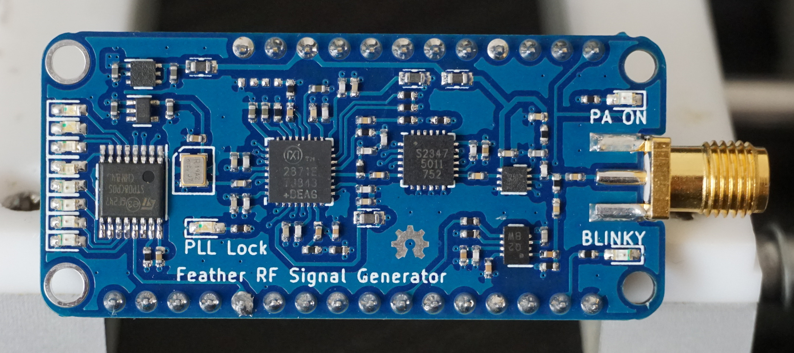
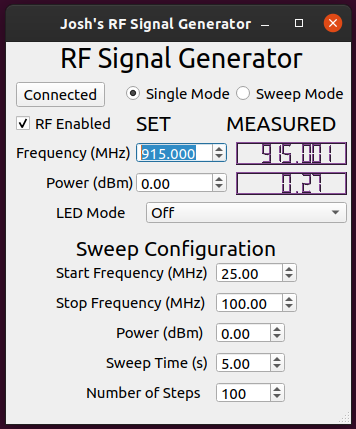
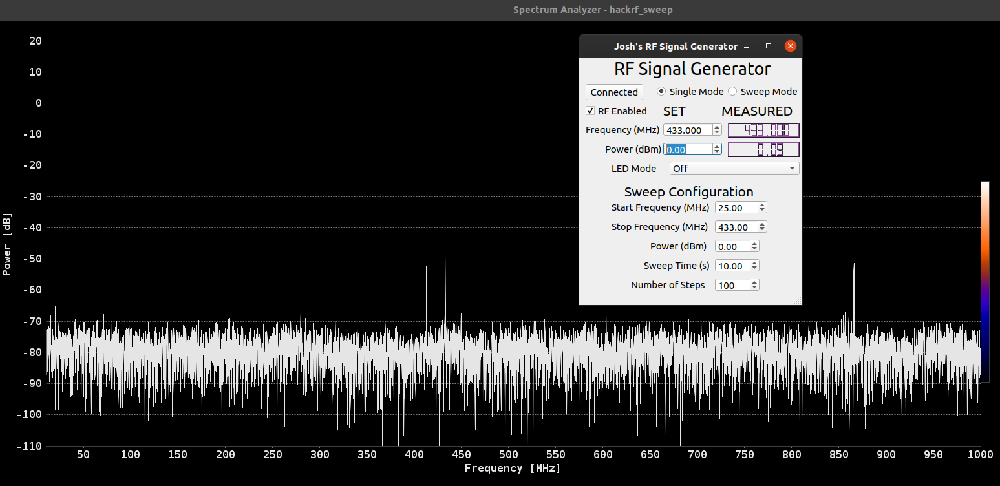

# RF Signal Generator

## 23.5 - 6000 MHz MAX2871 based RF signal generator in an Adafruit Feather form factor.
- MAX2871 23.5 - 6000 MHz Fractional/Integer-N Synthesizer/VCO
- -35 to +15 dBm output power (-25 to +10 across entire frequency range)
- Output control within 0.5 dB, with closed loop feedback
- GUI allowing easy control, including sweep capabilities
- Adafruit Feather form factor
- Firmware works with my [STM32F103 Feather](https://github.com/joshajohnson/stm32f103-feather)

### TODO

#### Software
- [ ] Display not updating if time between frequency steps in sweep is too long (greater than UART timeout)
- [ ] Map keyboard to frequency and power adjustment in GUI

#### Firmware
- [ ] Calibrate output power
- [ ] Rewrite with RTOS to ensure a more responsive user experience
- [ ] Add ability to select Frac / Int N PLL settings
- [ ] Dimmable LEDs

#### Hardware
- [ ] Many pin locations incorrect (SPI pins off by one...)
- [ ] LED's back to front, and connected to GND instead of VCC
- [ ] Feather footprint internal pin numbers incorrect